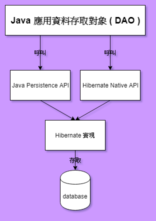

# JPA -vs- Hibernate 原生 API

 

## 早期與現在

在早期 Hibernate 3.2 以前， Hibernate 並未支援 JPA 規範，應該說各家 ORM 框架都有自己的一套規範。這時應用程式如果要使用 Hibernate 做持久層技術就只能使用 Hibernate 原生 API。我在做這份筆記的時候，Hibernate 已經來到 6.0 版本了，之前做專案使用的是 Hibernate 3.2，專案中學長對於實體的設定是使用 JPA 規範 ( 註解 )，而連線取得則是使用 Hibernate 原生 API ( SessionFactory )。

官方也已經聲明了，使用 SessionFactory 已經是半淘汰的方法，儘管 6.0 版本仍然可以使用，但是還是主要推薦 JPA 規範來取的得資料庫連線對象 ( EntityManager )。畢竟是 Hibernate 跟 Sun 公司一起訂出來的嘛~

接下來是 JPA 與 Hibernate 原生 API 的關係圖展示 : 

可以看到，其實使用 Java Persitence API 與 Hibeernate Native API 都可以做到同樣的事，只是會有一些小的差異。接下來會分別探討 Java Persitence API 與 Hibeernate Native API 兩種不同的方式以及最終比較。